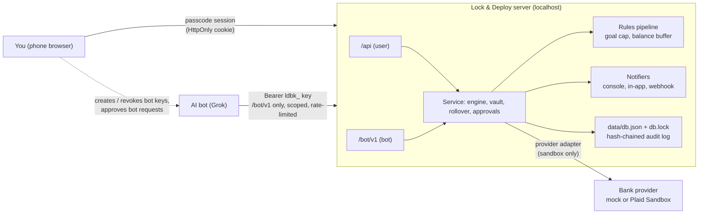

# Lock & Deploy · Savings vault prototype (SANDBOX ONLY)

A personal prototype for Lance (ZigFlames). It links **two of your own bank accounts** with a token-based link flow, deposits a set amount automatically on a schedule (for example "the day after my SSI arrives"), counts only **settled** money, and keeps it in a **Hard Lock** vault until the goal is reached. After that you can **Roll Over & Relock** into the next goal. An AI bot (such as Grok) can operate it through a scoped, logged, approval-gated API.

> **No real money can move.** The only providers are an offline `mock` (default) and **Plaid Sandbox**. Production is hard-disabled in code (see [Production guard](#production-guard)), and every go-live gate is unmet. No Stripe Checkout or payment-page tricks are used.
>
> Research, with citations and live-ACH fees: [`docs/RESEARCH.md`](docs/RESEARCH.md). Short version: no provider lets one person legitimately run self-to-self ACH without a business, KYB and a contract (Plaid Transfer excludes same-person transfers; Stripe forbids personal use). The cheapest real path is your **bank's free recurring transfer**, with the bank enforcing the lock (CD, withdrawal-hold account, ABLE), and this app as the monitor.

**Try it on your phone:** <https://zigflames.com/lock-and-deploy-vault/>. It's a browser-only, installable PWA build of this same code (fictional money, stored only in your browser). See [`docs/STATIC_DEMO.md`](docs/STATIC_DEMO.md) for how it reuses the server modules and how it differs.

Separate from the phase-1 simulation PWA (`lock-and-deploy`). Same look: near-black, gold `#D4AF37`, lock icon.

More docs: [Emergency access & the bank](docs/EMERGENCY_ACCESS.md) · [Secrets](docs/SECRETS.md) · [Extending (notifiers, providers, rules)](docs/EXTENDING.md) · [Bot API (OpenAPI)](docs/bot-api.openapi.json)

---

## Architecture



**You → Bot → App → Bank.** The bot never talks to the bank, never sees bank passwords or provider tokens, and can't unlock anything. Sensitive bot actions become approval requests that only you can approve in the app.

## Run it (mock mode, no keys)

Requires Node 20+.

```bash
cd lock-and-deploy-bank
npm install            # installs the official `plaid` client (only loaded in plaid-sandbox mode)
cp .env.example .env   # optional; defaults are fine for mock
npm start              # http://127.0.0.1:5180
```

- **First visit asks you to set an app passcode** (min 8 characters). Sessions use an HttpOnly, SameSite=Strict cookie. Login is rate-limited (5 tries per 15 minutes). **More → Lock the app (log out)** ends the session.
- **Forgot the app passcode?** `npm run reset-passcode` (needs shell access to the machine). It clears the passcode and sessions and revokes all bot keys. It **does not unlock the vault** or change the goal. This is only the app's own passcode: your **bank** password is handled only by your bank's normal recovery.
- **Unattended engine:** the server runs the engine every `SCHEDULER_INTERVAL_SECONDS`. Without the server, `npm run tick` runs one pass (cron/systemd friendly). `npm run tick -- --advance 30` moves the sandbox clock 30 days, one pass per day. Both take `data/db.lock`, and every deposit has an idempotency key, so parallel runs never double-debit.
- **Pinned demo date:** `SIM_DATE=2026-10-05 npm start` (or in `.env`). The demo clock buttons add days on top.

### Walkthrough (phone-sized window)
1. **Accounts → Link a bank account.** Mock Link sheet: consent → pick one of two fictional banks → "Continue as sandbox user" → share accounts. There are no credential fields. Link the second bank, then mark **Pull from** (funding) and **Save to** (savings).
2. **Plan:** goal (default: Mattress, $3,000, milestone $1,500), release date, **Hard Lock (on by default)**, amount and schedule ("after my benefit payment arrives": SSI 1st, SS/SSDI 3rd or 2nd/3rd/4th Wednesday, custom day, plus N days). Weekends and bank holidays move to the next business day.
3. **Authorize:** acknowledge the **SSI/benefit-limit warning**, type your name, read the **ACH debit authorization** (`ach-auth-v2-sandbox`), tick the box. The goal **locks at this moment**. Text, SHA-256 hash, time, IP and user agent are logged.
4. **Home / Transfers:** deposits appear on schedule and move **pending → posted → settled**. Home shows **settled vs pending** separately; only settled money counts. Before every pull the engine checks the funding balance and **defers** (up to 3 business days) if the pull would leave less than the $100 buffer. Use the **Sandbox demo clock** (+1/+7/+30) to move time.
5. **Vault:** shows the Hard Lock. At the goal (settled), a one-time **unlock code** is generated. It is shown exactly once, then only a hash is kept.
6. **Roll Over & Relock:** e.g. $3,000 in vault → withdraw $1,000 (simulated) → $2,000 stays locked → new goal $4,000 → needs $2,000 → relocked immediately, deposits continue. Also "raise only" (no withdrawal) and "withdraw all" (close, or restart a new goal).
7. **Inbox:** approval requests from the bot. **More → Bot:** create/revoke bot keys and see every bot call. **More → Settings:** defaults and go-live gates. **More → Emergency stop & your bank.** **More → Log:** audit trail with hash-chain status.

## Hard Lock (on by default)

There is **no emergency withdrawal or early-unlock path in the app**. The vault opens in one way only: the **settled** balance reaching the goal (and, if you chose the stricter rule, the release date having passed).

- No override code, no admin bypass, no "unlock" endpoint. The AI bot can't unlock either (`unlock`, `early_unlock`, `bypass_lock`, `hardship_release`, `disable_hard_lock`, `lower_goal` and similar are forbidden request types → 403).
- Withdraw, reveal code and rollover all return `423 vault_locked` while saving.
- Pending deposits never count. If a deposit is returned after unlock, the vault relocks.

**Loosening is blocked while locked** (`423 lock_loosening_blocked`, audited as `lock_loosening_refused`):

| Change while the goal is locked | Allowed? |
|---|---|
| Raise the target, add milestones, rename | ✅ |
| Move the release date later / switch to the stricter "goal AND date" rule | ✅ |
| Lower the target | ❌ |
| Turn off Hard Lock | ❌ |
| Add a hardship release, or shorten its cooling-off | ❌ |
| Move the release date earlier / drop the "AND date" requirement | ❌ |
| Change settings defaults | ✅ but they apply to **new** goals only, never the locked one |

**Optional hardship release** (off by default). It exists only for a goal created **with Hard Lock off**, and it can only be chosen while the goal is a draft (before you authorize deposits). It can never be added later. Rules: a cooling-off period (default **30 days**, minimum 7) from the request, typing the phrase `I UNDERSTAND THIS BREAKS MY LOCK`, cancellable at any time during the wait, and every step logged (`hardship_requested`, `hardship_cancelled`, `hardship_released`). **With Hard Lock on, this option does not exist.**

## Emergency stop & your bank account

- **Emergency stop** (More → Emergency stop & your bank; user only, the bot can't trigger or disable it): **pauses all future deposits and revokes every bot key** (and cancels pending bot approvals). It **never unlocks the vault or releases money**. The button says "Emergency stop (does not unlock)". Resume deposits from Transfers when ready.
- **Your bank account: the facts.** The app is a discipline tool. It can't legally or technically stop your bank from giving you, the account owner, your own money, and the app and bot never touch your bank's login, password reset or account recovery. Bank password problems go through the bank's normal recovery.
- **Make the lock stronger at the bank:** separate bank from everyday checking · no debit card on the savings account · don't install that bank's app on your phone · a CD (early-withdrawal penalty) or a Fort Knox-style withdrawal-hold account (bank-enforced delay) · optionally a sealed envelope with the savings login held by a trusted person · an ABLE account if you get SSI.

Details: [`docs/EMERGENCY_ACCESS.md`](docs/EMERGENCY_ACCESS.md).

## Savings engine

- **Periods ledger:** each due date gets a row keyed `scheduleId:date` with status `due → creating → created | deferred | skipped | failed`. The row is saved (write-ahead) before the provider call, so a crash or a second process can't create a duplicate debit. The provider call also carries the same idempotency key.
- **Rules pipeline** before every pull: `goalCap` (never pull past the goal; pending counts toward the cap; the last pull is reduced) and `balanceBuffer` (read the funding account's available balance; defer or skip if it would drop below the buffer; never pull blind when the balance is unknown and `requireBalanceCheck` is on).
- **Returns:** R05/R07/R10/R11/R29 (unauthorized/revoked) pause the schedule for review; `pauseAfterReturns` (default 2) returns of any kind auto-pause.
- **Milestones and goal** are checked on settled money only. Notifications go to the console, an in-app banner, and optionally a signed webhook.

## AI bot API

The user creates a key in **More → Bot** (shown once, stored as SHA-256). Scopes: `read`, `propose`, `pause`, `request`. Keys are rate-limited per key (default 30/min), bad keys are throttled per IP, every call (including refused ones) is in the bot activity log and the audit log, and a bot key is refused on the user API (`/api`).

| Endpoint | Scope | Effect |
|---|---|---|
| `GET /bot/v1/status`, `/goals`, `/transfers`, `/schedule`, `/approvals`, `/activity` | read | Read-only views (no tokens, no codes, no account numbers) |
| `POST /bot/v1/goals/propose` | propose | Creates an approval request (202) |
| `POST /bot/v1/rollovers/prepare` | propose | Prepares a rollover for you to confirm with your code (202) |
| `POST /bot/v1/schedule/pause` | pause | Pauses future deposits immediately (safe direction) |
| `POST /bot/v1/requests` | request | Resume, schedule change, funding-account change, settings change, withdrawal (only after unlock, needs your code) → approval (202). Unlock/bypass/production/lower-goal types → 403 |

```bash
# curl
curl -s -H "Authorization: Bearer $LDB_BOT_KEY" http://127.0.0.1:5180/bot/v1/status
curl -s -H "Authorization: Bearer $LDB_BOT_KEY" -H 'Content-Type: application/json' \
  -d '{"targetCents":350000,"reason":"aim a bit higher"}' http://127.0.0.1:5180/bot/v1/goals/propose

# CLI (same thing; dollars in, JSON out)
export LDB_BOT_KEY=ldbk_...   # from More > Bot
npm run bot -- status
npm run bot -- propose-goal --target 3500 --reason "aim a bit higher"
npm run bot -- prepare-rollover --withdraw 1000 --new-target 4000
npm run bot -- pause
npm run bot -- request resume_schedule --reason "funds look fine"
```

Full schema: [`docs/bot-api.openapi.json`](docs/bot-api.openapi.json).

## Settings

Defaults live in [`config/default-settings.json`](config/default-settings.json); your overrides are saved in the data file (More → Settings, or `POST /api/settings` with nested JSON such as `{"safety":{"bufferCents":15000}}`). Every key is validated (`server/settings.js`), unknown keys are rejected. Settings are **defaults for new goals**: they never loosen a locked goal. Not settings on purpose: provider/production mode (env + code only), emergency stop, the audit log. The bot can never change `hardLock.defaultOn`, hardship minimums, unlock limits or its own rate limit.

| Group | Keys (default) |
|---|---|
| goal | name (Mattress), targetCents (300000), lockDays (365), unlockRule (goal), milestonesCents ([150000]) |
| hardLock / hardship | defaultOn (true) / coolingOffDaysDefault (30), minCoolingOffDays (7) |
| contribution | amountCents (25000), frequency (benefit), benefitType (ssi), offsetDays (1) |
| safety | bufferCents (10000), onInsufficientFunds (defer), deferMaxBusinessDays (3), requireBalanceCheck (true), pauseAfterReturns (2) |
| unlock | codeExpiryDays (30), maxAttempts (5) |
| rollover | defaultWithdrawCents (100000), defaultNewTargetCents (400000), fullWithdrawal (close) |
| notifications | console (true), inApp (true), webhook (false) |
| bot | rateLimitPerMinute (30), approvalExpiryDays (7) |
| mock | fundingBalanceCents (150000) |

## Switch to Plaid Sandbox

1. Create a free Plaid account at <https://dashboard.plaid.com/signup> (Sandbox needs no approval). Copy the **Sandbox** `client_id` and `secret` from *Developers → Keys*.
2. In `.env`:
   ```
   PROVIDER=plaid-sandbox
   PLAID_ENV=sandbox
   PLAID_CLIENT_ID=...
   PLAID_SECRET=...            # the Sandbox secret. Server-side only; never in the browser or git.
   TOKEN_ENCRYPTION_KEY=...    # node -e "console.log(require('crypto').randomBytes(32).toString('base64'))"
   ```
3. `npm run check:plaid` runs a live **sandbox** smoke test with no UI: `/sandbox/public_token/create` → exchange → `/accounts/get` → `/transfer/authorization/create` ($11.11 debit) → `/transfer/create` → `/sandbox/transfer/simulate` → `/transfer/get`. Without keys it prints what is missing and exits 2.
4. `npm start`, then open **Accounts → Link a bank account** (real Plaid Link, Sandbox institutions; test user `user_good` / `pass_good`) or tap **Sandbox: skip Link** (First Platypus Bank).
5. Statuses sync by polling `/transfer/event/sync` on every scheduler tick. For push updates, expose `POST /api/webhooks/plaid-sandbox` through an HTTPS tunnel, set `PLAID_WEBHOOK_URL`, and the `Plaid-Verification` JWT (ES256 + body SHA-256 + 5-minute age) is verified before anything is processed.

**Money model in Plaid mode.** Plaid Transfer debits the funding account into the originator's *Plaid Ledger*, then a separate **credit leg** pays the destination account. The app creates the credit leg automatically once the debit settles. In Sandbox, "settled" also calls `/sandbox/transfer/ledger/simulate_available` so the credit can be funded. This models the flow. It is **not** a production-approved use (see the research doc).

If you get `PRODUCT_NOT_ENABLED` for Transfer in Sandbox, older Plaid teams may need Transfer enabled by support (<https://plaid.com/docs/transfer/sandbox/>).

## What you need: sandbox vs. production

### Sandbox (what this prototype uses)
| Item | Where you get it | Cost | Can an individual get it? | What it unlocks |
|---|---|---|---|---|
| Nothing (mock mode) | n/a | Free | Yes | The whole flow offline, with fake banks and a demo clock |
| Plaid account + **Sandbox** `client_id`/`secret` | dashboard.plaid.com → Developers → Keys | Free, unlimited | **Yes.** Sandbox: "Approval: None", "All developers" | Link, Auth, Transfer endpoints against mock data, `/sandbox/transfer/simulate`, test clock |
| Transfer enabled in Sandbox | On by default for new teams; older teams ask support | Free | Yes | `/transfer/*` in sandbox |
| `TOKEN_ENCRYPTION_KEY` | Generate locally (command above) | Free | Yes | AES-256-GCM encryption of access tokens at rest |
| HTTPS tunnel URL (optional) | Any tunnel tool | Free tiers exist | Yes | Webhook push instead of polling |

### Production (NOT enabled here; listed so the gap is clear)
| Item | Where you get it | Cost | Can an individual get it? | What it would unlock |
|---|---|---|---|---|
| Plaid **Production** access | Production Request in Dashboard (company + use-case info) | Pay-as-you-go/Growth prices shown when applying | Unclear for a person with no company | Real Link/Auth/Balance data |
| Plaid **Trial plan** (read-only option) | Dashboard, US/CA teams created on/after Apr 15, 2026 | Free, 10 Items | Probably ("hobbyist use"; "auto-approved for most developers") but unconfirmed | **Real balances/transactions, no money movement.** The realistic next step for this app |
| Plaid **Transfer** approval | Transfer Application + document collection (business entity, control person, SSN/EIN, ACH projections) | **Custom plan, 12-month minimum**, per-transfer, per-auth and per-Item fees | **No for this use.** Plaid Transfer "does not support … transfers between two accounts held by the same person" | Real ACH debits/credits |
| Business entity + EIN, KYB | State filing, IRS | Filing fees vary | Only by forming a business | Needed by Dwolla, Moov, Increase, Column, Unit, Teller production |
| Stripe live account (Financial Connections + ACH Direct Debit) | stripe.com | Per-transaction | Sole proprietors can sign up, **but** the SSA bans "personal, family, or household purposes" | Nothing usable for this case |
| Secrets manager, hosted HTTPS backend, backups | Your infrastructure | Varies | Yes | Safe hosting (this prototype is localhost-only with a local passcode) |
| Legal/compliance review (Nacha, Reg E, money transmission, benefits) | Attorney/compliance advisor | Varies | Yes | Required before any real-money program |

## What's needed to go live (all unmet)

The code evaluates six gates (`server/golive.js`, shown in **More → Settings**): provider approval for this exact use, independent security review, Nacha-compliant authorization records, verification that account recovery is untouched, an SSI/ABLE review, and finally a reviewed code change to `REAL_MONEY_ENABLED`. There is deliberately no API or setting that marks a gate as met. Fees and eligibility for each provider: [`docs/RESEARCH.md`](docs/RESEARCH.md#provider-for-live-ach-cheapest-legitimate-path-checked-september-25-2026).

Other items before any real money: provider KYB and written use-case approval; legal review (money transmission, Nacha WEB/PPD, Reg E, E-SIGN); managed secrets instead of `.env`; a real database with backups; public HTTPS webhooks with signature checks and idempotency; mandate receipts to the user; low pilot caps and reconciliation.

## Production guard

These layers are all in code; none can be switched on from the environment:
1. **`REAL_MONEY_ENABLED = false`** is a hard-coded constant in `server/config.js`. It is not read from env.
2. **`assertSandboxOnly(env)`** runs before the server listens and **refuses to start** when:
   - `PROVIDER` is anything other than `mock` or `plaid-sandbox`;
   - `PLAID_ENV` is set to anything but `sandbox` (even in mock mode), or `PROVIDER=plaid-sandbox` without `PLAID_ENV=sandbox`;
   - any `PLAID_*` value mentions `production.plaid.com`;
   - any `STRIPE_*` value is a live key (`sk_live_`, `rk_live_`, `pk_live_`);
   - any "flip it on" flag is set: `ALLOW_PRODUCTION`, `ENABLE_PRODUCTION`, `ENABLE_REAL_MONEY`, `REAL_MONEY`, `LIVE_MODE`, `PRODUCTION`;
   - `NODE_ENV=production`.
3. The **Plaid host is hard-coded** to `https://sandbox.plaid.com` (it is not configurable), and the adapter re-checks it before **every** call (`assertSandbox()`). A production secret sent to the sandbox host just fails authentication.
4. **Every money-moving service call** (`createPull`, `createCreditLeg`, `runScheduler`) asserts `REAL_MONEY_ENABLED === false && provider.sandbox === true`.
5. `POST /api/real-transfers/activate` requires the benefit acknowledgement in the same request, then **always** returns `403 production_disabled` with the list of unmet go-live gates.
6. The AI bot can't request production mode at all (`switch_production` is a forbidden request type, 403).

The tests in `test/guard.test.js` cover every refusal above.

## Security model

- **No bank credentials, ever.** Linking is token-based (mock Link or Plaid Link). The server stores provider IDs, the **encrypted** access token (AES-256-GCM), account names, subtypes and the last-4 mask. No usernames, passwords, full account or routing numbers. The app and bot never touch bank login, password reset or recovery.
- **Hashed secrets:** the app passcode (scrypt), bot keys (SHA-256), and unlock codes (scrypt; the plaintext is held encrypted only until shown once). See [`docs/SECRETS.md`](docs/SECRETS.md).
- **Two separate front doors:** `/api` needs your passcode session and refuses bot keys; `/bot/v1` needs a scoped bot key and can't reach user-only actions (approve, unlock, emergency stop, settings that loosen the lock, production).
- **Audit log** is append-only with a SHA-256 hash chain (`GET /api/audit/verify`, status shown on the Log screen).
- **Same-machine threat model:** anything that can read `data/` or `.env` as your OS user can read the store and token key. If the AI bot runs on the same computer, **run it as a separate OS user** that has no read access to `data/` and `.env`, and give it only the bot key and the URL. Keep `HOST=127.0.0.1`.
- Strict CSP (no inline scripts or styles; mock mode allows no third-party origins), JSON-only POSTs, same-origin check, data file mode 0600, `db.lock` file lock for the server and `npm run tick`.

## Project layout
```
server/
  index.js            entry: loads .env, production guard, starts server + scheduler
  config.js           env parsing + assertSandboxOnly() + REAL_MONEY_ENABLED=false
  app.js              HTTP routes, passcode auth, static files, CSP, webhook endpoint
  routes.js           user API route table (shared with the browser demo)
  service.js          goals + Hard Lock rules, engine, vault, rollover, hardship, approvals, emergency stop
  bot.js              /bot/v1 routes, key auth, scopes, rate limits, activity log
  settings.js         settings schema + validation (defaults in config/default-settings.json)
  rules/index.js      pre-pull rules pipeline (registerRule)
  notifiers/index.js  notification channels (registerNotifier)
  golive.js           go-live gates (all unmet)
  audit.js            hash-chained audit log
  secrets.js          unlock codes, scrypt/sha256 helpers
  schedule.js, dates.js, authorization.js, crypto.js, store.js
  providers/          BankProvider interface, registry, mock, Plaid Sandbox
public/               mobile-first UI (index.html, css/styles.css, js/app.js, icons/)
scripts/              tick.js, reset-passcode.js, check-plaid.js
bot-cli.js            shell client for the bot API
test/                 node:test suites + Playwright mobile pass (e2e_mobile.py)
docs/                 RESEARCH, EMERGENCY_ACCESS, SECRETS, EXTENDING, STATIC_DEMO, bot-api.openapi.json
demo/                 browser-only PWA build (src/browser-server.js + shims, static/, build.mjs)
screenshots/          390x844 screenshots from the headless run
```

## Tests
```bash
npm test               # 60 node:test tests: API, production guard, Plaid adapter (stubbed client), schedule math,
                       # engine (idempotency, balance buffer, returns), vault/Hard Lock/loosening/hardship/rollover, bot API
npm run test:e2e       # Playwright + system Chrome at 390x844; starts its own server; writes screenshots/ and test/last-e2e.json
```
- Screenshots (390x844, from the e2e run): `screenshots/01-link-accounts.png`, `02-schedule-setup`, `03-pending-transfers`, `04-paused`, `05-dashboard-pending-vs-settled`, `06-milestone-unlocked-code`, `07-rollover-wizard`, `08-approvals-inbox`, `09-bot-activity-log`, `10-emergency-access`, `11-vault-hard-lock`, `12-stronger-lock-at-bank`.
- **Not verified:** live calls to Plaid Sandbox (no keys were available), the real Plaid Link iframe, and the webhook notifier against a real endpoint. Run `npm run check:plaid` once you have Sandbox keys.

## Limitations
- Single user, local only. The passcode protects the UI; it is not internet-grade auth. Don't expose the server.
- The in-app lock is a commitment device. The money sits in **your** bank account and your bank will still let you withdraw it. Bank-enforced locks (CD, withdrawal hold, ABLE) are the stronger layer; see [`docs/EMERGENCY_ACCESS.md`](docs/EMERGENCY_ACCESS.md).
- Withdrawals and rollovers are ledger-only (simulated). Push, email and SMS notifications are not built (the notifier registry is where they would go).
- The file lock is best-effort on a local filesystem (not for network drives).
- Holidays follow Federal Reserve rules. SSA payment dates are modeled from SSA's published rules; confirm your actual deposit date.
